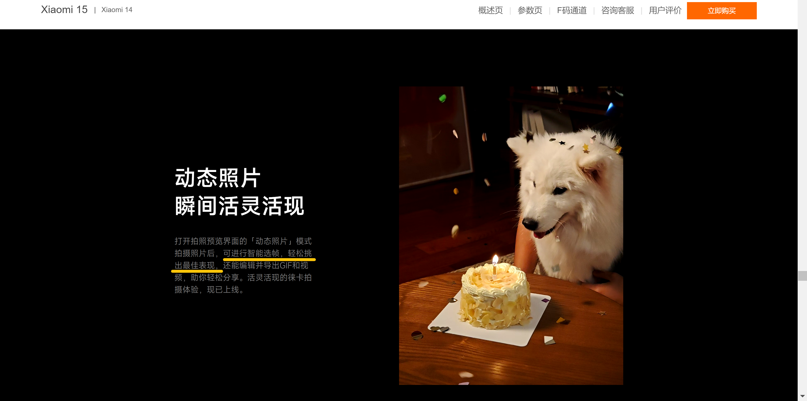

本人本硕均毕业于西安电子科技大学（211，双一流），在海康威视研究院担任算法工程师实习生，毕业后加入小米，担任相机算法工程师。本人兴趣主要包含AI图像算法、人脸分析、多模态大模型。希望可以通过技术让世界多一些美好和便捷！如有合作意愿，欢迎交流。

<!-- This is the front page of a website that is powered by the [Academic Pages template](https://github.com/academicpages/academicpages.github.io) and hosted on GitHub pages. [GitHub pages](https://pages.github.com) is a free service in which websites are built and hosted from code and data stored in a GitHub repository, automatically updating when a new commit is made to the repository. This template was forked from the [Minimal Mistakes Jekyll Theme](https://mmistakes.github.io/minimal-mistakes/) created by Michael Rose, and then extended to support the kinds of content that academics have: publications, talks, teaching, a portfolio, blog posts, and a dynamically-generated CV. You can fork [this template](https://github.com/academicpages/academicpages.github.io) right now, modify the configuration and markdown files, add your own PDFs and other content, and have your own site for free, with no ads! -->

参与项目
-------
1. 小米15LivePhoto智能封面选帧

2. 人脸表情驱动数据引擎

相关专利
-------
1. 精彩瞬间选帧（小米期间）
2. 黑烟车识别（已授权）

相关荣誉
-------
1. 小米青年工程师（约5%研发岗位可获得）
2. 小米手机部演讲大赛「我和小米手机的故事」获得前10名
3. 西安电子科技大学优秀毕业生（约5%可获得）

联系
------
如有任何问题，欢迎邮件咨询。（912362652@qq.com）
